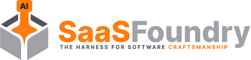

<div align="center">



# SaaSFoundryAI

**v1.0.0**

### Robust engineering, from day one.

A deterministic development harness for human–AI teams, with an optional production-ready SaaS foundation. Use either layer independently, or combine them to ship without rebuilding the same
engineering practices and product plumbing each time.

[Documentation](https://saasfoundryai.diamondforge.fr/) · [Documentation en français](https://saasfoundryai.diamondforge.fr/fr/) · [npm package](https://www.npmjs.com/package/saasfoundryai-cli)

[](https://www.npmjs.com/package/saasfoundryai-cli) [](LICENSE)

</div>

## Start in a minute

SaaSFoundryAI has two first-class interfaces. Both use the same CLI, manifest, installers and checks.

### From your terminal

Use Node.js 24.19.0 and npm 11 for the generated project. Docker is needed only when you choose Docker-managed local services.

```bash
# New project: choose the harness, SaaS stack, or both in the interactive setup
npx saasfoundryai-cli new

# Existing repository you want to keep: add only the harness in place
cd your-project
npx saasfoundryai-cli new --profile harness
```

Prefer a global command? Run `npm install -g saasfoundryai-cli`, then `sf new`. See the [short harness setup guide](https://saasfoundryai.diamondforge.fr/getting-started/install-harness.html) and
[full installation guide](https://saasfoundryai.diamondforge.fr/getting-started/installation.html).

### With an AI assistant

Open the folder in a coding assistant that can inspect the repository and run terminal commands, then say:

> Help me set up the SaaSFoundryAI development harness here. Inspect the existing project, propose the installation profile and CLI steps, then ask before changing files.

The assistant is an interface to the CLI, not a separate generator. It can guide the setup with Claude Code, Codex, Gemini CLI, Kimi Code, Qwen Code or another capable coding tool.

Claude Code also supports an optional one-line `tool-saasfoundry` skill bootstrap via `npx saasfoundryai-cli skill install --yes --force`; that installer currently targets Claude Code, but the harness
does not. GPT, DeepSeek, GLM and Kimi can name models or providers rather than coding tools: select the profile of the tool hosting the model, not the model name.
[Compare both paths](https://saasfoundryai.diamondforge.fr/getting-started/setup-paths.html).

## Two layers, one standard of care

| Layer                   | What it gives you                                                                                                        | Use it when                                                                                      |
| ----------------------- | ------------------------------------------------------------------------------------------------------------------------ | ------------------------------------------------------------------------------------------------ |
| **Development harness** | Shared instructions and skills, SRS and ticket handoffs, complexity-aware workflow, tests, human gates and pull requests | You already have a SaaS codebase and want humans and agents to deliver under the same rules      |
| **SaaS foundation**     | NestJS + React + PostgreSQL architecture with authentication, tenancy, scoped RBAC, typed APIs, tests and Docker support | You want the common application architecture ready before building your differentiating features |
| **Both**                | A ready technical foundation developed through the same guarded process                                                  | You are starting a product and want the two layers together                                      |

`sf new` lets you choose `harness`, `stack` or `full`. The harness does not require the SaaS stack; the stack can be used without the managed workflow.
[Explore the architecture](https://saasfoundryai.diamondforge.fr/features/built-in.html) and [installation profiles](https://saasfoundryai.diamondforge.fr/getting-started/installation.html).

## What makes the harness different

Software craftsmanship is operational from the first ticket. The Team workflow has seven visible stages: **Backlog → Ready → In progress → AI testing → Human testing → In review → Done**. Human
testing means feature testing; In review means code review. A five-stage Solo preset and advanced custom workflows are also available. Complexity adjusts the depth of analysis, validation and review,
so a typo and an authorization change do not incur the same ceremony.

Supported coding-agent profiles share one project contract across Claude Code, Codex, Gemini CLI, Kimi Code, Qwen Code and a generic agent. The harness records the tool profiles; it does **not**
automatically select or dispatch a model for each subtask. Provider-neutral planning contracts are available to host integrations that explicitly supply candidates, budgets and dispatch.
[See the workflow](https://saasfoundryai.diamondforge.fr/guide/workflow-system.html) and [agent coexistence](https://saasfoundryai.diamondforge.fr/guide/agent-coexistence.html).

## After setup

```bash
npx saasfoundryai-cli status --agent-friendly --no-network # Inspect the managed project
npx saasfoundryai-cli docs                              # Open the bundled documentation offline
npx saasfoundryai-cli update                            # Update the project or add supported modules
```

The documentation is available [online in English](https://saasfoundryai.diamondforge.fr/) and [French](https://saasfoundryai.diamondforge.fr/fr/), and also ships with the CLI for offline use. The
[first-project guide](https://saasfoundryai.diamondforge.fr/getting-started/first-project.html) walks through a complete run.

## Contributing

See the [development guide](https://saasfoundryai.diamondforge.fr/contributing/development.html) before opening a pull request. Changes to generated manifests or module file sets must follow the
[migration framework](.claude/docs/migration-framework.md). Commits use `<type>(#<ticket>): <description>`.

SaaSFoundryAI is [MIT licensed](LICENSE).
